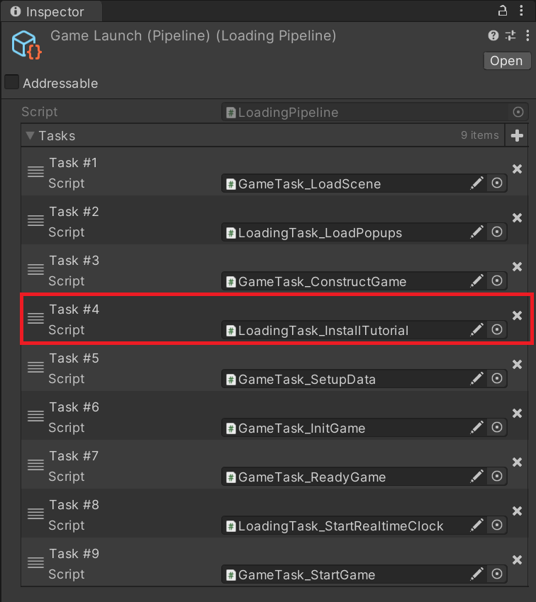
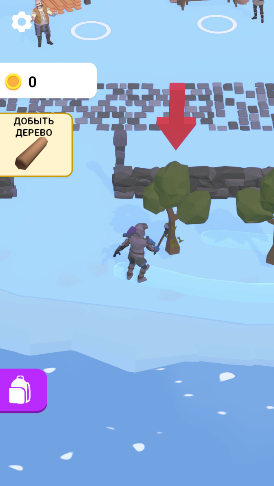
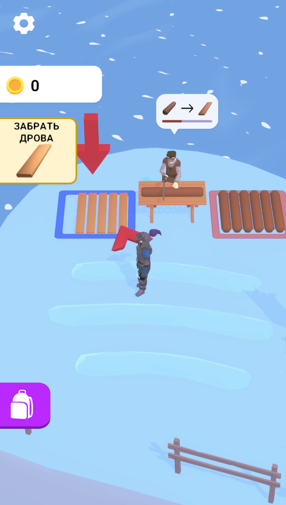
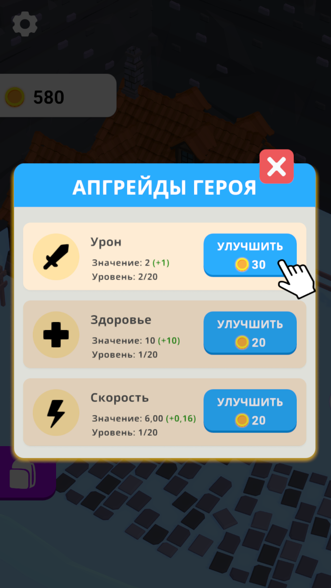
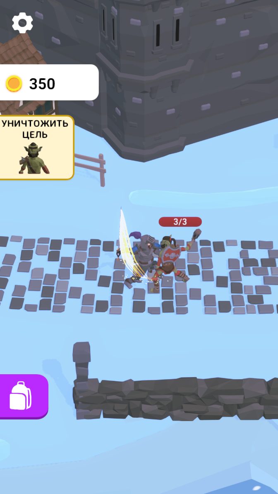

# Tutorial System

### Описание
1. Внедрил обучение в готовую игру. Обучение представляет собой отдельный гибкий и расширяемый модуль с возможностью выполнения промежуточных действий между шагами. Модульный подход позволяет удалить папку с обучением из проекта, и приложение продолжит запускаться без ошибок, но уже без обучения.
   
2. Сделал фейковый попап для квеста прокачки оружия (*PopupHeroUpgrades*).

### Соблюденные принципы
- KISS
- SRP
- OCP
  
### Запуск
Игра запускается через *LoadingScene*, находящуюся по пути:
- Assets\Game\Scenes\LoadingScene

### Компоненты системы
Ключевые скрипты:
- TutorialManager
- TutorialStepController

Шаги туториала располагаются по пути:

- Assets\Game\Tutorial\Content\
  
### Удаление папки Tutorial
Вместе с удалением папки Tutorial также необходимо удалить задачу загрузки обучения (см. скрин) в "*GameLaunch (Pipeline)*" (ScriptableObject).

### Скриншоты

